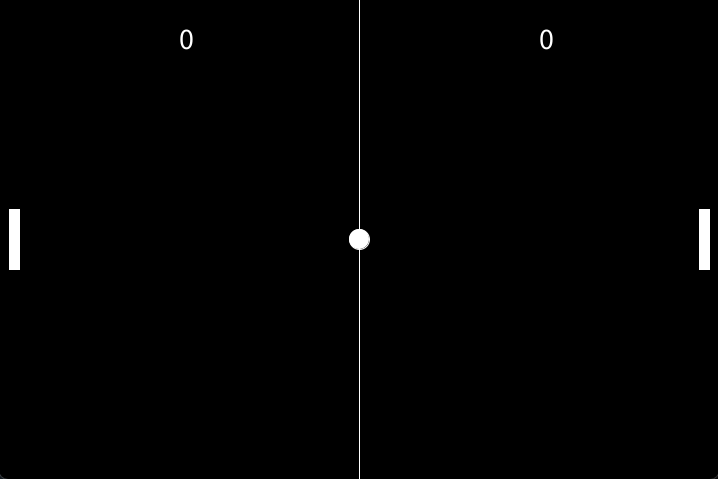
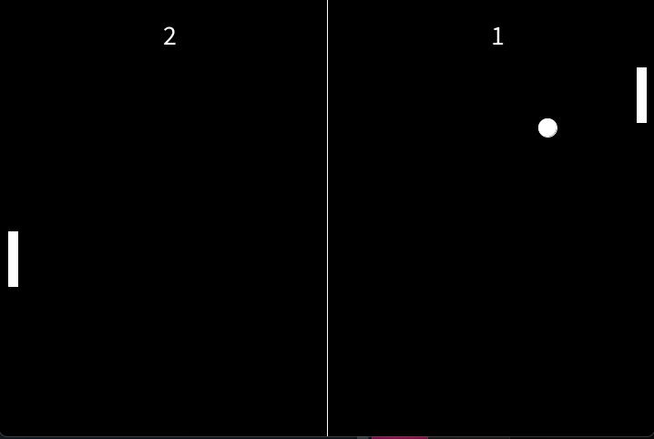

# Pong Game

## Description
This project is a simple recreation of the classic Pong game, developed using Processing.

It features basic paddle and ball mechanics, with two-player controls using the keyboard.

Players can control their paddles to bounce the ball back and forth, with the objective of scoring points by getting the ball past the opponent’s paddle.

The game includes score tracking, collision detection, and basic physics for realistic ball movement.

This project serves as an example of how to implement fundamental game mechanics in a straightforward and effective manner.

## How to Play
- One player uses arrows to move
- One Player uses W,S to move

## Screenshots
Here are some screenshots of the game:

## Installation
To play the game, ensure that you have Processing installed. Download the project files and run `Pong.pde` using Processing.

## Requirements
- Processing 3.0 or later

## GamePlay

[Watch the Gameplay Video](./Video_Pong.mp4)
